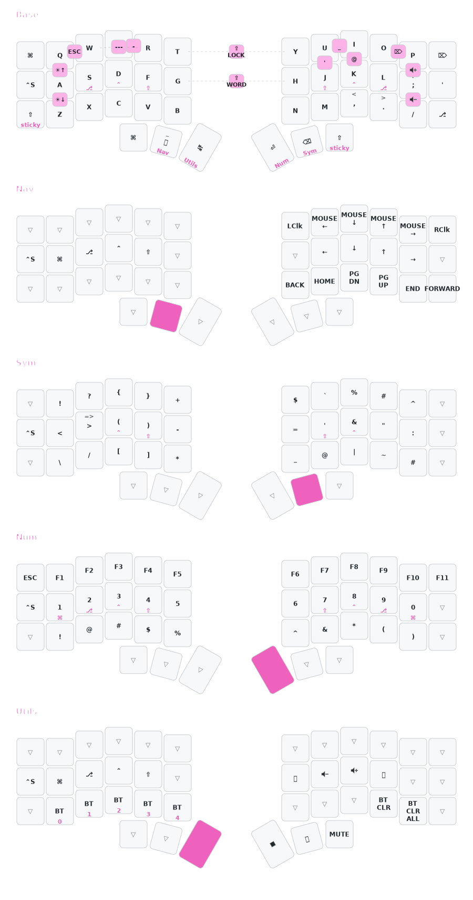

# Corne ZMK Keymap

Custom ZMK keymap for Corne keyboard with nice!nano v2 + nice!view displays.



## Layers

| # | Name  | Access     |
| --- | ------- | ------------ |
| 0 | BASE  | Default    |
| 1 | NAV   | Hold SPACE |
| 2 | SYM   | Hold BSPC  |
| 3 | NUM   | Hold RET   |
| 4 | UTILS | Hold TAB   |

## Setup

### Install kbflash

```bash
brew install dhavalsavalia/kbflash/kbflash
```

### Configure

```bash
cp config.kbflash.toml ~/.config/kbflash/config.toml
# Edit paths in config to match your system
```

## Building

```bash
./build.sh        # both halves
./build.sh left   # left only
./build.sh right  # right only
./build.sh reset  # settings_reset firmware
```

Output goes to `./firmware/`

## Flashing

```bash
kbflash
```

Follow TUI prompts - put each half into bootloader mode (double-tap reset) when prompted.

## Resetting (Clean Flash)

Use when keyboard has pairing issues or needs a fresh start:

1. Remove old "Corne" from Bluetooth devices, pair as new
2. Build reset firmware: `./build.sh reset`
3. Run `kbflash` and flash `settings_reset.uf2` to both halves
4. Wait a few seconds, then flash normal firmware
