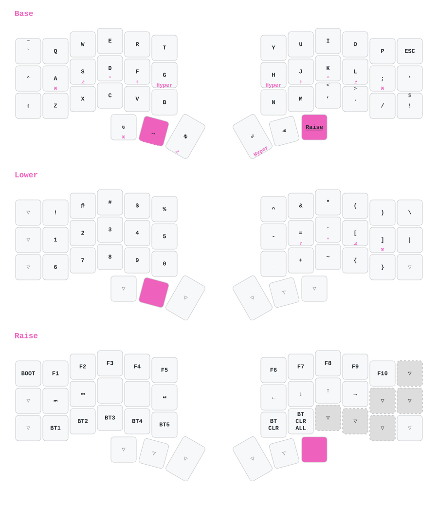

# corne-build


My ZMK config for a 42-key Corne split keyboard with nice!view displays.

A faithful ZMK port of [josean's QMK Corne layout](https://github.com/josean-dev/dev-environment-files/blob/main/qmk/crkbd_rev1_3x6_josean.json) — same layers, keycodes, and beginner-friendly philosophy. A simple, clean baseline; personal customizations (combos, homerow mods) come in a later pass.



## Features

- Plain QWERTY base layer (no homerow mods)
- Three layers: Base, Lower (symbols + numbers), Raise (F-keys, media, arrows)
- Left-inner thumb mod-tap: tap Enter / hold Alt
- Right-inner thumb mod-tap: tap Space / hold Hyper (Ctrl+Shift+Alt+Cmd)
- Momentary layer switches on the remaining inner/outer thumbs

## Layers

| Layer | Access                  | Purpose                       |
| ----- | ----------------------- | ----------------------------- |
| Base  | Default                 | QWERTY                        |
| Lower | Hold left-inner thumb   | Symbols + numbers             |
| Raise | Hold right-outer thumb  | F-keys, media, arrow nav      |

### Thumb cluster

```
Left:   Cmd      Lower(hold)    Alt/Enter
Right:  Hyper/Space   Backspace    Raise(hold)
```

## Build & Flash

Grab firmware artifacts from latest workflow run from .
It builds for each haves,

- Left: `corne_left nice_view_adapter nice_view-nice_nano-zmk.uf2`
- Right: `corne_right nice_view_adapter nice_view-nice_nano-zmk.uf2`

Flash by putting each half into bootloader mode (double-tap reset button) and copying the respective UF2 file to the mounted drive. The drive is usually named `NICENANO` on my Mac.
Once successfully flashed, nice!nano should eject itself. Do this for both halves.

## Credits

- [josean](https://github.com/josean-dev/dev-environment-files) for the original QMK layout this ports
- [keymap-drawer](https://github.com/caksoylar/keymap-drawer) for visualization
- [zmk-helpers](https://github.com/urob/zmk-helpers) for cleaner keymap syntax
